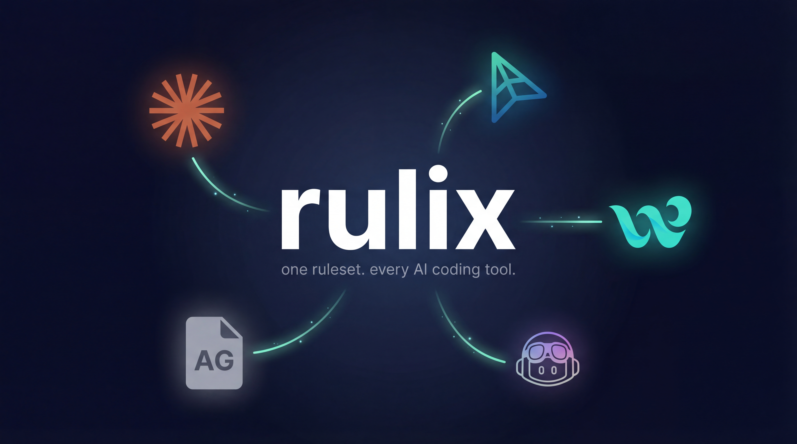

<h1 align="center">Rulix</h1>

<p align="center">
  
</p>

<p align="center">
  <a href="https://www.npmjs.com/package/rulix"></a>
  <a href="https://github.com/danielcinome/rulix/actions/workflows/ci.yml"></a>
  <a href="https://github.com/danielcinome/rulix/blob/main/LICENSE"></a>
  <a href="https://www.npmjs.com/package/rulix"></a>
  
</p>

<p align="center">
  <a href="#installation">Installation</a> &middot;
  <a href="#quick-start">Quick Start</a> &middot;
  <a href="docs/getting-started.md">Getting Started</a> &middot;
  <a href="docs/cli-reference.md">CLI Reference</a> &middot;
  <a href="docs/api-reference.md">API Reference</a> &middot;
  <a href="CONTRIBUTING.md">Contributing</a>
</p>

---

Rulix is a CLI tool and TypeScript library that gives you a **single source of truth** for AI coding rules across Cursor, Claude Code, AGENTS.md, and more.

Write your rules once. Rulix generates optimized configs for each tool — handling format differences, scoping semantics, and token budgets automatically.

## Why Rulix?

Every AI coding tool has its own rules format:

| Tool | Format | Location |
|---|---|---|
| Cursor | `.mdc` with YAML frontmatter | `.cursor/rules/` |
| Claude Code | Markdown with optional frontmatter | `.claude/rules/` |
| AGENTS.md | Plain markdown | `AGENTS.md` |
| Windsurf | Markdown | `.windsurf/rules/` |
| Copilot | Markdown | `.github/copilot-instructions.md` |

If you use more than one tool, you're maintaining duplicate rules that drift apart. Rulix solves this:

```
.rulix/rules/              .cursor/rules/*.mdc
  ├── typescript.md    →   .claude/rules/*.md
  ├── testing.md       →   AGENTS.md
  └── security.md      →   (more targets coming)
```

## Installation

```bash
# npm
npm install -D rulix

# pnpm
pnpm add -D rulix

# yarn
yarn add -D rulix

# bun
bun add -D rulix
```

Or run directly with `npx`:

```bash
npx rulix init
```

> **Requirements**: Node.js 22 or higher.

## Quick Start

### 1. Initialize your project

```bash
npx rulix init
```

This creates a `.rulix/` directory with a `config.json` and a `rules/` folder.

### 2. Import existing rules (optional)

Already have rules in Cursor or Claude Code? Import them:

```bash
npx rulix import --from cursor
npx rulix import --from claude-code
```

### 3. Write a rule

Create `.rulix/rules/typescript-strict.md`:

```markdown
---
id: typescript-strict
scope: always
description: "Enforce strict TypeScript conventions"
category: style
priority: 1
---

# TypeScript Conventions

- Use `strict: true` in tsconfig
- Never use `any` — prefer `unknown` with type narrowing
- Use explicit return types on public functions
- Prefer `interface` over `type` for object shapes
```

### 4. Sync to your tools

```bash
npx rulix sync
```

This generates tool-specific configs for every target in your `config.json`.

### 5. Validate your rules

```bash
npx rulix validate
```

Catches duplicates, vague descriptions, missing fields, and token budget issues.

### 6. Check status

```bash
npx rulix status
```

Shows rule count, token budget usage per tool, and configured targets.

## Rule Format

Rules live in `.rulix/rules/*.md` as Markdown with YAML frontmatter:

| Field | Type | Required | Description |
|---|---|---|---|
| `id` | `string` | Yes | Unique kebab-case identifier |
| `scope` | `"always" \| "file-scoped" \| "agent-selected"` | Yes | When the rule applies |
| `description` | `string` | Yes | What the rule does (used by AI for selection) |
| `category` | `"style" \| "security" \| "testing" \| "architecture" \| "workflow" \| "general"` | No | Rule category (defaults to `"general"`) |
| `priority` | `1-5` | No | 1 = critical, 5 = nice-to-have (defaults to `3`) |
| `globs` | `string[]` | If `file-scoped` | File patterns this rule applies to |

**Scopes explained:**

- **`always`** — Applied to every AI request. Use for project-wide conventions.
- **`file-scoped`** — Applied only when matching files are open. Requires `globs`.
- **`agent-selected`** — The AI decides when to apply this rule based on its `description`.

See [Writing Rules](docs/writing-rules.md) for detailed examples and best practices.

## Key Features

- **Import** existing rules from Cursor or Claude Code
- **Export** to Cursor, Claude Code, and AGENTS.md (more targets coming)
- **Validate** rules for duplicates, conflicts, and vague content
- **Token budgets** — know when your rules exceed a tool's recommended limits
- **Zero LLM dependency** — all validation is deterministic, works offline
- **Programmatic API** — use Rulix as a library in your own tools
- **Zero config** — sensible defaults, override only what you need

## Supported Tools

| Tool | Import | Export | Status |
|---|---|---|---|
| Cursor | Yes | Yes | v0.1 |
| Claude Code | Yes | Yes | v0.1 |
| AGENTS.md | — | Yes | v0.1 |
| Windsurf | — | — | Planned |
| Copilot | — | — | Planned |
| Codex | — | — | Planned |

## Configuration

Rulix is configured via `.rulix/config.json`:

```json
{
  "targets": ["cursor", "claude-code", "agents-md"],
  "presets": [],
  "overrides": {},
  "options": {
    "tokenEstimation": "heuristic",
    "agentsMdHeader": true,
    "syncOnSave": false
  }
}
```

See [Configuration Reference](docs/configuration.md) for all options.

## Programmatic API

Rulix can be used as a library in your own tools:

```typescript
import { loadRuleset, exportRules, validateRuleset } from "rulix";

// Load rules from a project
const ruleset = await loadRuleset("./my-project");

// Validate
const result = validateRuleset(ruleset);
console.log(result.passed); // true if no errors

// Export to a specific tool
await exportRules("cursor", ruleset.rules, "./my-project");
```

See [API Reference](docs/api-reference.md) for the complete API.

## Contributing

Contributions are welcome! The most impactful ways to help:

1. **New adapters** — Add support for Windsurf, Copilot, Cline, etc.
2. **Validation rules** — New checks for common rule issues
3. **Bug reports** — Especially format edge cases

See [CONTRIBUTING.md](CONTRIBUTING.md) for setup and guidelines, and [Writing an Adapter](docs/adapters.md) for the adapter guide.

## Author

**Daniel Chinome** — [@danielcinome](https://github.com/danielcinome)

## License

[MIT](LICENSE)
